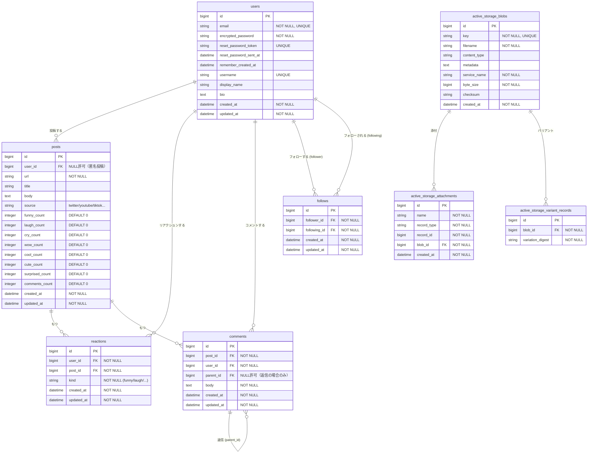

# ER図

> Mermaid 記法。GitHub / VSCode の Mermaid プレビューで表示できます。

## アプリケーションテーブル

---

## インフラ系テーブル（Solid Queue / Cache / Cable）

Rails 8 標準の DB バックエンドアダプター。Redis 不要で PostgreSQL に一元管理。

```mermaid
erDiagram
    solid_cache_entries {
        bigint id PK
        binary key "NOT NULL"
        bigint key_hash "NOT NULL, UNIQUE INDEX"
        binary value "NOT NULL"
        integer byte_size "NOT NULL"
        datetime created_at "NOT NULL"
    }

    solid_cable_messages {
        bigint id PK
        binary channel "NOT NULL"
        bigint channel_hash "NOT NULL"
        binary payload "NOT NULL"
        datetime created_at "NOT NULL"
    }

    solid_queue_jobs {
        bigint id PK
        string queue_name "NOT NULL"
        string class_name "NOT NULL"
        text arguments
        integer priority "DEFAULT 0"
        string active_job_id
        datetime scheduled_at
        datetime finished_at
        string concurrency_key
        datetime created_at "NOT NULL"
        datetime updated_at "NOT NULL"
    }

    solid_queue_ready_executions {
        bigint id PK
        bigint job_id FK "NOT NULL, UNIQUE"
        string queue_name "NOT NULL"
        integer priority "DEFAULT 0"
        datetime created_at "NOT NULL"
    }

    solid_queue_scheduled_executions {
        bigint id PK
        bigint job_id FK "NOT NULL, UNIQUE"
        string queue_name "NOT NULL"
        integer priority "DEFAULT 0"
        datetime scheduled_at "NOT NULL"
        datetime created_at "NOT NULL"
    }

    solid_queue_claimed_executions {
        bigint id PK
        bigint job_id FK "NOT NULL, UNIQUE"
        bigint process_id
        datetime created_at "NOT NULL"
    }

    solid_queue_blocked_executions {
        bigint id PK
        bigint job_id FK "NOT NULL, UNIQUE"
        string queue_name "NOT NULL"
        integer priority "DEFAULT 0"
        string concurrency_key "NOT NULL"
        datetime expires_at "NOT NULL"
        datetime created_at "NOT NULL"
    }

    solid_queue_failed_executions {
        bigint id PK
        bigint job_id FK "NOT NULL, UNIQUE"
        text error
        datetime created_at "NOT NULL"
    }

    solid_queue_recurring_executions {
        bigint id PK
        bigint job_id FK "NOT NULL, UNIQUE"
        string task_key "NOT NULL"
        datetime run_at "NOT NULL"
        datetime created_at "NOT NULL"
    }

    solid_queue_recurring_tasks {
        bigint id PK
        string key "NOT NULL, UNIQUE"
        string schedule "NOT NULL"
        string class_name
        string command
        text arguments
        string queue_name
        integer priority "DEFAULT 0"
        boolean static "DEFAULT true"
        text description
        datetime created_at "NOT NULL"
        datetime updated_at "NOT NULL"
    }

    solid_queue_processes {
        bigint id PK
        string kind "NOT NULL"
        datetime last_heartbeat_at "NOT NULL"
        bigint supervisor_id
        integer pid "NOT NULL"
        string hostname
        string name "NOT NULL"
        text metadata
        datetime created_at "NOT NULL"
    }

    solid_queue_pauses {
        bigint id PK
        string queue_name "NOT NULL, UNIQUE"
        datetime created_at "NOT NULL"
    }

    solid_queue_semaphores {
        bigint id PK
        string key "NOT NULL, UNIQUE"
        integer value "DEFAULT 1"
        datetime expires_at "NOT NULL"
        datetime created_at "NOT NULL"
        datetime updated_at "NOT NULL"
    }

    solid_queue_jobs ||--|| solid_queue_ready_executions : "実行待ち"
    solid_queue_jobs ||--|| solid_queue_scheduled_executions : "スケジュール済み"
    solid_queue_jobs ||--|| solid_queue_claimed_executions : "処理中"
    solid_queue_jobs ||--|| solid_queue_blocked_executions : "ブロック中"
    solid_queue_jobs ||--|| solid_queue_failed_executions : "失敗"
    solid_queue_jobs ||--|| solid_queue_recurring_executions : "定期実行履歴"
```

---

## インデックス一覧（ユニーク制約・複合インデックス）

| テーブル | カラム | 種別 |
|---|---|---|
| users | email | UNIQUE |
| users | username | UNIQUE |
| users | reset_password_token | UNIQUE |
| posts | user_id | INDEX |
| reactions | user_id, post_id, kind | UNIQUE（同一リアクション重複防止） |
| reactions | post_id | INDEX |
| reactions | user_id | INDEX |
| comments | post_id | INDEX |
| comments | user_id | INDEX |
| comments | parent_id | INDEX |
| follows | follower_id, following_id | UNIQUE（重複フォロー防止） |
| follows | follower_id | INDEX |
| follows | following_id | INDEX |
| active_storage_blobs | key | UNIQUE |
| active_storage_attachments | record_type, record_id, name, blob_id | UNIQUE |
