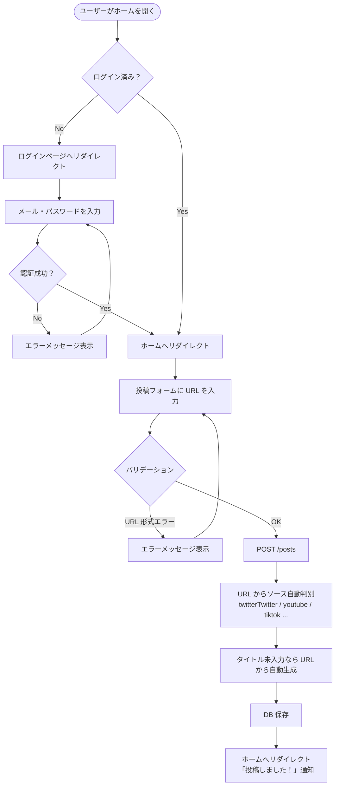
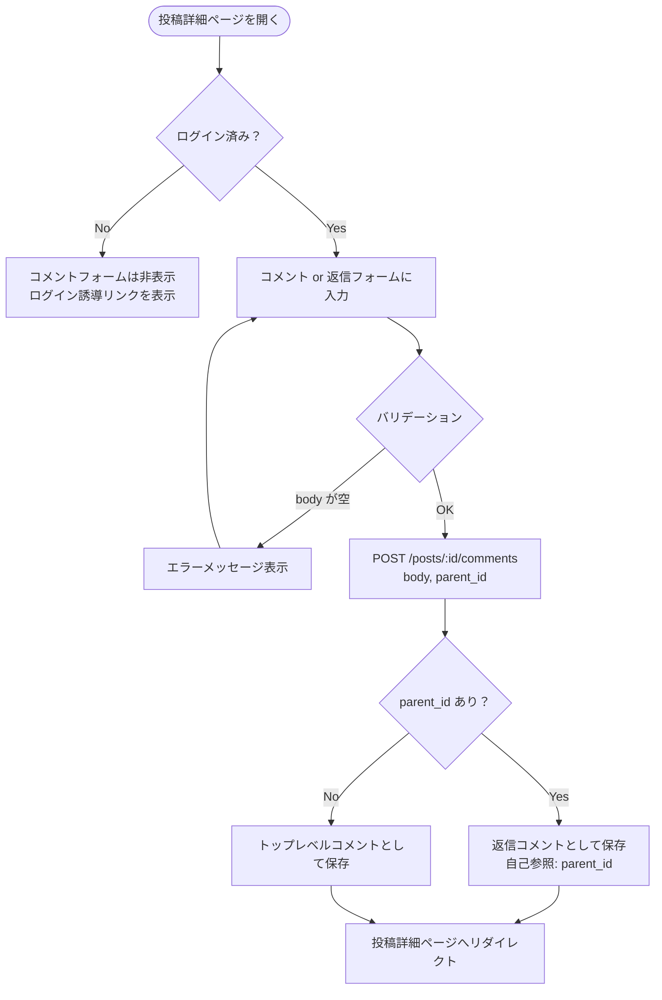
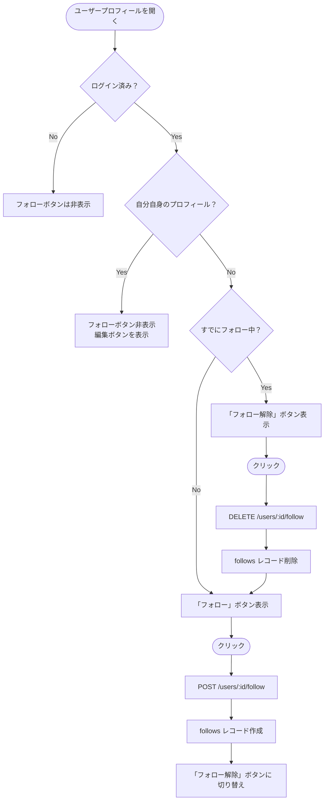
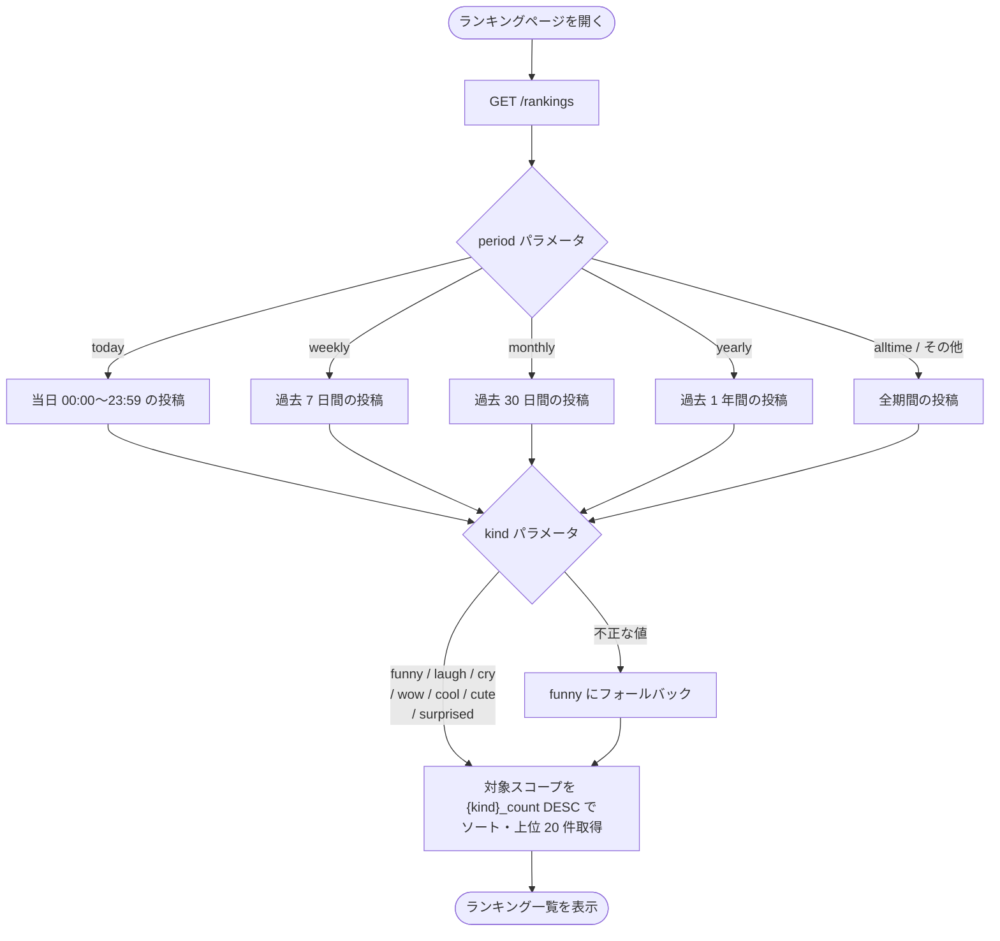
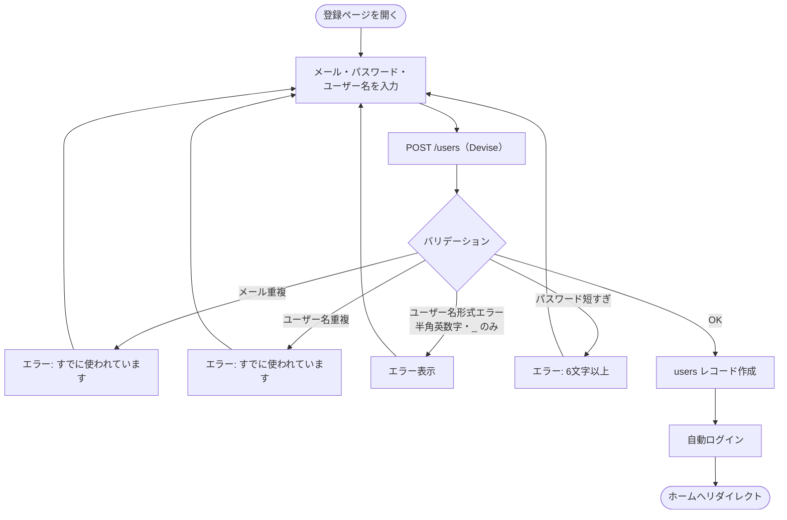

# フローチャート図

> Mermaid 記法。GitHub / VSCode の Mermaid プレビューで表示できます。

---

## 1. 投稿フロー



---

## 2. リアクションフロー（Turbo Stream）

```mermaid
flowchart TD
    A([リアクションボタンをクリック]) --> B{ログイン済み？}
    B -- No --> C[ログインページへリダイレクト]
    B -- Yes --> D[POST /posts/:id/reactions\nkind=funny など]

    D --> E{同じ kind のリアクションが\nすでに存在する？}
    E -- Yes --> F[reaction レコードを削除\n＝トグル OFF]
    E -- No --> G[reaction レコードを作成\n＝トグル ON]

    F --> H[post の {kind}_count を再集計]
    G --> H
    H --> I[Turbo Stream レスポンス]
    I --> J[ページ内の reactions パーシャルだけ差し替え]
    J --> K([カウント・ボタン色がリアルタイム更新])
```

---

## 3. コメント投稿フロー



---

## 4. フォローフロー



---

## 5. ランキング表示フロー



---

## 6. ユーザー登録フロー


