# ユースケース図

> Mermaid 記法。GitHub / VSCode の Mermaid プレビューで表示できます。

```mermaid
flowchart TB
    subgraph actors["アクター"]
        G["👤 ゲスト\n（未ログイン）"]
        U["🔑 ログインユーザー"]
    end

    subgraph auth["認証"]
        UC01["ユーザー登録\n（メール＋パスワード）"]
        UC02["ログイン / ログアウト"]
        UC03["パスワードリセット"]
    end

    subgraph browse["閲覧・検索"]
        UC04["投稿一覧を見る"]
        UC05["投稿詳細を見る\n（埋め込みプレビュー）"]
        UC06["ランキングを見る\n（期間 × リアクション種別）"]
        UC07["ユーザープロフィールを見る"]
    end

    subgraph post_actions["投稿操作"]
        UC08["URLを投稿する"]
        UC09["自分の投稿を削除する"]
    end

    subgraph reaction_actions["リアクション・コメント"]
        UC10["リアクションする / 取り消す\n（7種類：funny/laugh/cry/wow/cool/cute/surprised）"]
        UC11["コメントを投稿する"]
        UC12["コメントに返信する"]
        UC13["自分のコメントを削除する"]
    end

    subgraph social_actions["ソーシャル"]
        UC14["ユーザーをフォローする"]
        UC15["フォローを解除する"]
    end

    subgraph profile_actions["プロフィール管理"]
        UC16["プロフィールを編集する\n（表示名・自己紹介・アバター・カバー画像）"]
    end

    %% ゲストができること
    G --> UC01
    G --> UC02
    G --> UC04
    G --> UC05
    G --> UC06
    G --> UC07

    %% ログインユーザーができること（ゲストの操作 + 追加機能）
    U --> UC02
    U --> UC03
    U --> UC04
    U --> UC05
    U --> UC06
    U --> UC07
    U --> UC08
    U --> UC09
    U --> UC10
    U --> UC11
    U --> UC12
    U --> UC13
    U --> UC14
    U --> UC15
    U --> UC16

    %% スタイル
    style G fill:#e0f2fe,stroke:#0284c7
    style U fill:#fef9c3,stroke:#ca8a04
    style auth fill:#f0fdf4,stroke:#16a34a
    style browse fill:#eff6ff,stroke:#3b82f6
    style post_actions fill:#fdf4ff,stroke:#a855f7
    style reaction_actions fill:#fff7ed,stroke:#ea580c
    style social_actions fill:#fdf2f8,stroke:#db2777
    style profile_actions fill:#f0fdfa,stroke:#0d9488
```

---

## ユースケース一覧

| # | ユースケース | ゲスト | ログインユーザー |
|---|---|:---:|:---:|
| UC01 | ユーザー登録 | ✅ | — |
| UC02 | ログイン / ログアウト | ✅ | ✅ |
| UC03 | パスワードリセット | — | ✅ |
| UC04 | 投稿一覧を見る | ✅ | ✅ |
| UC05 | 投稿詳細・埋め込みプレビューを見る | ✅ | ✅ |
| UC06 | ランキングを見る | ✅ | ✅ |
| UC07 | ユーザープロフィールを見る | ✅ | ✅ |
| UC08 | URLを投稿する | — | ✅ |
| UC09 | 自分の投稿を削除する | — | ✅ |
| UC10 | リアクションする / 取り消す | — | ✅ |
| UC11 | コメントを投稿する | — | ✅ |
| UC12 | コメントに返信する | — | ✅ |
| UC13 | 自分のコメントを削除する | — | ✅ |
| UC14 | ユーザーをフォローする | — | ✅ |
| UC15 | フォローを解除する | — | ✅ |
| UC16 | プロフィールを編集する | — | ✅ |
